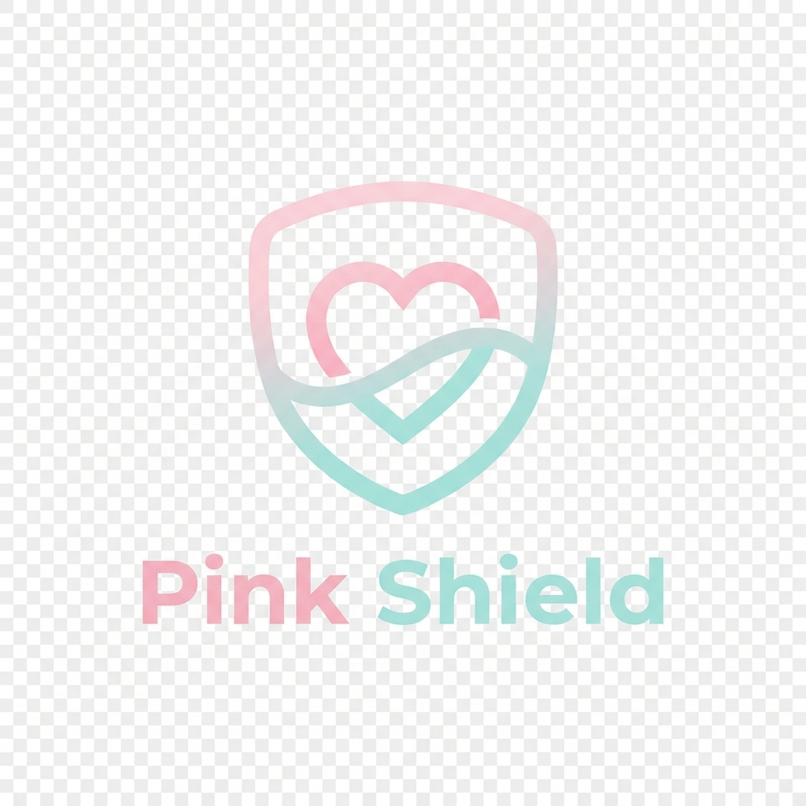

# Pink Shield - Women's Safety App



## Overview

**Pink Shield** is a comprehensive women's safety application designed with accessibility, community, and AI-powered protection at its core. Inspired by the Kavalan/Kaaval Uthavi app style, Pink Shield provides a clean, minimalist, and inclusive user experience.

### Tagline
**"Safety. Community. Accessibility."**

### Mission
*Powered by Community • Enhanced by AI • Accessible for All*

---

## Features

### 🛡️ Core Safety Features
- **Emergency SOS**: One-tap emergency alert (no login required)
- **Location Sharing**: Real-time location sharing with emergency contacts
- **Safe Journey Tracking**: Monitor and track safe routes
- **Nearby Help**: Find nearby police stations, hospitals, and safe spaces
- **Community Alerts**: Real-time safety updates from the community

### ♿ Accessibility Features
- **Voice Navigation**: Complete voice-guided interface
- **Vibration Alerts**: Haptic feedback for important notifications
- **Tap-Pattern SOS**: Trigger emergency with a specific tap pattern (5 taps)
- **Large Icons Mode**: Enhanced visibility for users with visual impairments
- **Multi-language Support**: Tamil, English, Hindi, Malayalam, Telugu, Kannada

### 👥 Community Features
- **Role-based Access**: Viewer, Writer, and Author roles
- **Community Feed**: Share and view safety tips and experiences
- **Verified Content**: Author-created verified safety information

---

## Application Flow

### 1. Splash Screen
- Beautiful gradient background (pink → teal)
- SAFEAURA logo with shield, heart, and wave elements
- Tagline and mission statement
- Auto-transitions to Welcome Screen after 3 seconds

### 2. Welcome Screen
- Language selection (6 languages)
- Login and Sign Up options
- Emergency SOS button (accessible without login)

### 3. Sign Up Page
- User information collection (Name, Phone, Email, Gender, District)
- OTP verification for phone number
- Role selection with tooltips
- Accessibility preferences setup

### 4. Login Page
- Phone and password authentication
- OTP login option
- Forgot password recovery

### 5. Permissions Setup
- Location, Microphone, Camera, Notifications, Background Activity
- Clear explanations for each permission
- "Allow All" or "Review Manually" options

### 6. Setup Complete
- Success animation with checkmark
- Confirmation message
- Navigate to Home button

### 7. Home Screen (Main App)
- Quick action cards (Share Location, Call Contacts, Safe Journey, Nearby Help)
- Safety status indicator
- Community feed
- Bottom navigation (Home, Map, Community, Profile)

---

## Design System

### Color Palette
- **Pastel Pink**: `#F9DDE1` - Primary brand color
- **Pastel Teal**: `#A9E9E4` - Secondary brand color
- **Deep Pink**: `#E91E63` - Accent color
- **Deep Teal**: `#00BCD4` - Accent color
- **Emergency Red**: `#FF3B30` - Emergency actions

### Typography
- **Primary Font**: Inter (body text)
- **Display Font**: Outfit (headings and titles)

### Design Principles
1. **Minimalist**: Clean, uncluttered interface
2. **Accessible**: WCAG 2.1 AA compliant
3. **Inclusive**: Designed for users with disabilities
4. **Friendly**: Soft colors and rounded corners
5. **Responsive**: Works on all screen sizes

---

## Keyboard Shortcuts

- **Ctrl + E**: Trigger Emergency SOS
- **Ctrl + H**: Navigate to Home Screen

---

## Accessibility Compliance

SAFEAURA is designed to meet WCAG 2.1 Level AA standards:

- ✅ Keyboard navigation support
- ✅ Screen reader compatible (ARIA labels)
- ✅ High contrast mode support
- ✅ Reduced motion support
- ✅ Focus indicators for all interactive elements
- ✅ Semantic HTML structure

---

## Technology Stack

- **HTML5**: Semantic markup
- **CSS3**: Modern styling with custom properties
- **Vanilla JavaScript**: No framework dependencies
- **Progressive Web App**: Offline capability (future)
- **Service Worker**: Background functionality (future)

---

## Getting Started

### Installation

1. Clone or download this repository
2. Open `index.html` in a modern web browser
3. No build process required!

### Running Locally

Simply open the `index.html` file in your browser:

```bash
# Using Python
python -m http.server 8000

# Using Node.js
npx serve

# Or just open the file directly
start index.html
```

Then navigate to `http://localhost:8000` in your browser.

---

## File Structure

```
pinkshield/
├── index.html          # Main HTML file with all screens
├── styles.css          # Complete design system and styles
├── script.js           # Application logic and interactivity
├── logo.png            # SAFEAURA logo
└── README.md           # This file
```

---

## Future Enhancements

### Phase 2
- [ ] Backend API integration
- [ ] Real-time location tracking
- [ ] SMS/Call integration for emergency contacts
- [ ] Audio/video recording during emergencies
- [ ] Map integration with safe routes

### Phase 3
- [ ] AI-powered threat detection
- [ ] Community verification system
- [ ] Safe space directory
- [ ] Offline mode with service workers
- [ ] Native mobile apps (iOS/Android)

### Phase 4
- [ ] Wearable device integration
- [ ] Smart city integration
- [ ] Government emergency services integration
- [ ] Advanced analytics and reporting

---

## Contributing

We welcome contributions to make SAFEAURA even better! Please follow these guidelines:

1. Fork the repository
2. Create a feature branch
3. Make your changes
4. Test accessibility features
5. Submit a pull request

---

## Privacy & Security

SAFEAURA takes privacy seriously:

- 🔒 All data is encrypted
- 🔒 Location data is only shared with your consent
- 🔒 Emergency contacts are stored securely
- 🔒 No data is sold to third parties
- 🔒 GDPR compliant

---

## Support

For support, please contact:
- Email: support@safeaura.com
- Emergency Helpline: 1091 (Women's Helpline India)
- Website: www.safeaura.com

---

## License

Copyright © 2026 SAFEAURA. All rights reserved.

---

## Acknowledgments

- Inspired by Kavalan/Kaaval Uthavi app
- Built with accessibility and inclusion in mind
- Designed for the safety and empowerment of women everywhere

---

**Remember: Your safety matters. You are not alone. SAFEAURA is here to protect you.**

🛡️ Stay Safe • 💖 Stay Connected • ♿ Stay Empowered
